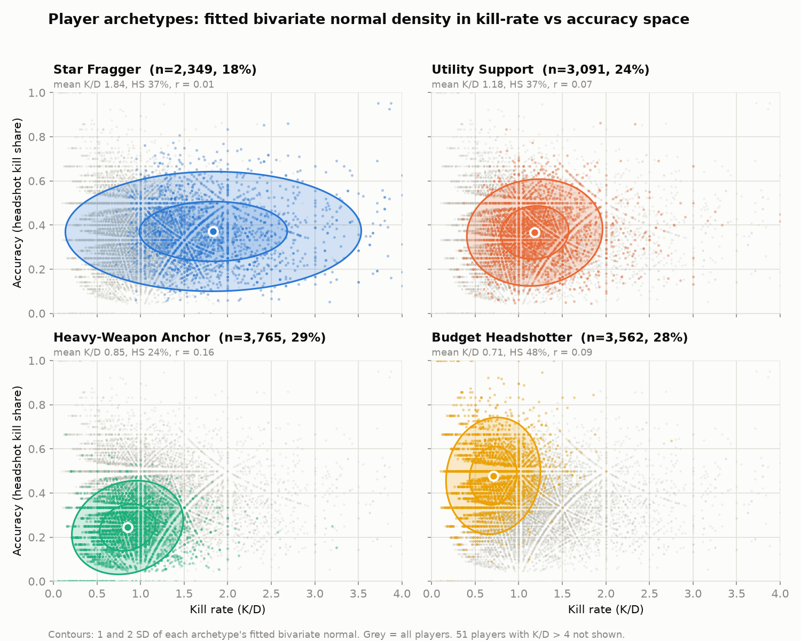
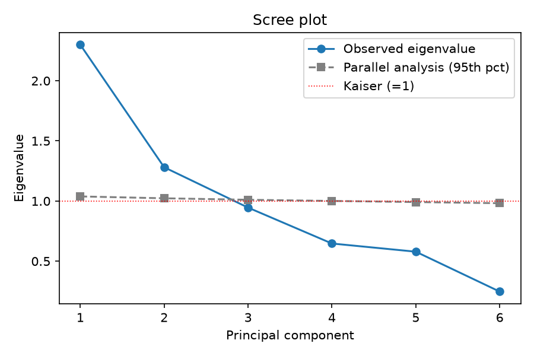
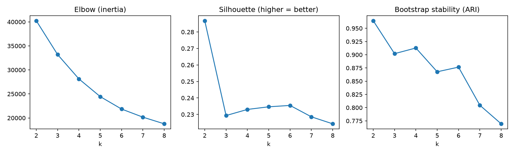

# Multivariate Player Performance Profiling and Win Prediction in Competitive Gaming

MCAI513B-3 Multivariate Techniques, CIA 3 | MSc Computational Statistics & Applied AI, CHRIST (Deemed to be University), 2026-27
Domain: Data Science / Analytics x E-Gaming (CS:GO)

**Live dashboard:** https://cia-3-multivariate-3uu8xfiopaykb7zyxjemur.streamlit.app/
(Free Streamlit Community Cloud. If the app has been idle it may show a "wake up" button; click it and wait a few seconds.)



## 1. Problem statement

Player performance in esports is usually judged by one number, kill/death ratio (KDA). That hides the *joint* performance signature: how a player's aggression, accuracy, reaction, map control and economy vary together. This project

1. profiles players by their joint KPI vector (PCA, then K-Means archetypes),
2. tests whether winning teams' mean KPI vectors differ from losing teams' (MANOVA, Wilks' Lambda),
3. visualises the archetypes as bivariate normal densities over kill rate vs accuracy, and
4. serves it as a dashboard: enter a team's player KPIs, get archetype labels, a team balance score and a win probability.

Everything is deterministic Python (pandas, numpy, scikit-learn, scipy, statsmodels, matplotlib, Streamlit). No LLM, no external APIs, no paid services.

## 2. Data

**Source:** [CS:GO Competitive Matchmaking Data](https://www.kaggle.com/datasets/skihikingkevin/csgo-matchmaking-damage) (Kaggle, `skihikingkevin`). Only the matchmaking files are used: `mm_master_demos.csv` (955,466 damage events) and `mm_grenades_demos.csv` (366,098 grenade rows), covering **1,297 matches and 32,752 rounds** played 20-28 Sept 2017. The ESEA files in the same archive were deliberately not used (no per-player kill log, no winner column, no equipment values in one place).

The data is **event-level**, not pre-aggregated. `src/build_kpis.py` aggregates it to one row per (match, player).

### Limitations of the data (please read)

| Issue | What was done |
|---|---|
| No kill/death column | Kills are **inferred**: a victim dies on the event where their cumulative `hp_dmg` in a round first reaches 100 (227,762 of 284,476 victim-rounds sum to exactly 100). This gives 232,987 inferred deaths, of which 230,308 are valid kills (7.0 per round, 36% headshots). The attacker on that event gets the kill. World deaths (1,462), suicides (86) and team kills (1,131) count as deaths but not kills. **Known weakness:** 5,225 victim-rounds (1.8%) receive more than 100 HP of damage, and in many of them the victim appears to keep fighting after the first crossing, so the first crossing is not always the real death (a crude re-run excluding those victim-rounds moves Wilks' Lambda from 0.447 to 0.458). |
| No shots fired, so no true accuracy | **Substitution:** accuracy = headshot share of kills. |
| No reaction-time telemetry | **Substitution:** reaction = opening-kill rate (share of rounds where the player got the round's first kill). |
| Equipment value is per team, not per player | **Substitution:** economy = player-level *loadout value*, the damage-weighted average buy price of the guns the player used. The price table (`src/weapon_prices.py`) is hand-entered from approximate 2017 in-game prices; it is not part of the dataset. |
| Very few repeat players (10,956 players in the analysed table, median 1 match, only 114 with 5+ matches) | The unit of analysis is the **player-match row**, not a player career. |
| Winner and loser of a match are dependent | Handled in the MANOVA design (section 4.3). |
| KPIs come from the same match whose result they explain | Rounds are won by eliminations: the winning team has more kills in 94% of rounds, and K/D alone gives AUC 0.977. The MANOVA and win model therefore describe a largely mechanical relationship. Read Wilks' Lambda as an effect-size description, not as evidence of a hidden "signature", and the win probability as "how likely is a team with this KPI profile to be a winning team", **not a pre-match forecast**. |

### Sample after filtering

- Player-match rows with at least 10 rounds played: **12,767** (from 1,289 matches; 8 matches of 7-9 rounds and 3 rows with undefined loadout value dropped). Steam IDs are replaced by random pseudonyms (`P00001`, ...) in the published data.
- Team-matches: 2,578. **Ties** (124 matches, equal rounds won) are kept for PCA and clustering but excluded from MANOVA and the win model, leaving **2,330 team-matches (1,165 winners, 1,165 losers)**. All 124 ties are genuine 15-15 draws. Only 44 non-tie matches ended without either team reaching 16 rounds; they are kept and labelled by round majority (results are unchanged when restricted to complete matches). Teams that are not exactly 5 players are kept (team means are taken over the players present).

## 3. KPIs

| KPI | Definition | Role |
|---|---|---|
| `kd` | kills / max(deaths, 1) | Aggression |
| `hs_pct` | headshot kills / kills (0 if no kills) | Accuracy (proxy) |
| `adr` | damage dealt to opponents / rounds played | Impact |
| `opening_rate` | rounds where the player made the first valid kill / rounds played | Reaction (proxy) |
| `utility_pr` | unique grenade throws / rounds played | Map control (proxy) |
| `loadout_value` | damage-weighted mean gun price, $ | Economy (proxy) |

Rounds played = last minus first round in which the player appears. Player rank is excluded so skill labels do not leak into the archetypes.

## 4. Methods and results

### 4.1 PCA

The six KPIs are z-scored and PCA is run on the correlation matrix.

- Suitability: Bartlett's test of sphericity chi2 = 17,284 (p ~ 0); KMO = 0.634 (mediocre but acceptable; headshot % is lowest at 0.48).
- Kaiser and parallel analysis both suggest 2 components. **3 were retained** (75.4% of variance) because PC3 (eigenvalue 0.95) is interpretable and carries the utility signal.

| PC | Eigenvalue | Variance | Loadings above 0.4 | Reading |
|---|---|---|---|---|
| PC1 | 2.30 | 38.3% | ADR .88, K/D .85, opening .69, loadout .47 | Aggression / impact |
| PC2 | 1.28 | 21.4% | headshot % .76, utility .49, loadout -.65 | Precision vs weapon tier (the "economy" axis) |
| PC3 | 0.95 | 15.8% | utility .75, headshot % -.47, opening -.38 | Utility / support |



### 4.2 K-Means archetypes

K-Means (20 starts, seed 42) on PC1-PC3, evaluated for k = 2 to 8 with silhouette, Davies-Bouldin, elbow and bootstrap stability. **k = 4** was chosen for interpretability (four distinct roles, no cluster below 18%, stable under resampling with bootstrap ARI 0.91), not because the silhouette favours it.

| Archetype | Share | K/D | Headshot % | ADR | Opening rate | Utility/round | Loadout $ |
|---|---|---|---|---|---|---|---|
| Star Fragger | 18% | 1.84 | 37% | 110 | 0.20 | 1.09 | 2,589 |
| Utility Support | 24% | 1.18 | 37% | 84 | 0.09 | 1.71 | 2,204 |
| Heavy-Weapon Anchor | 29% | 0.85 | 24% | 69 | 0.08 | 0.69 | 2,503 |
| Budget Headshotter | 28% | 0.71 | 48% | 66 | 0.07 | 0.81 | 1,927 |

**Caveat:** the silhouette score is only about 0.23 at every k. Players form a continuum, so the archetypes are useful *segments*, not naturally separated groups. An independent check supports this: a structureless Gaussian cloud with the same PC covariance gives a similar silhouette (0.228 at k=4, against 0.233 observed), and the partition is sensitive to preprocessing (agreement ARI 0.72 when K/D is dropped, 0.38 after a Yeo-Johnson transform). Treat the archetypes as a descriptive segmentation.



### 4.3 MANOVA (Wilks' Lambda)

Unit: one row per (match, team) holding the team's mean KPI vector; ties excluded.

**Assumption checks were run before the test, and both failed:**

| Assumption | Result |
|---|---|
| Multivariate normality (Mardia) | Rejected (p ~ 0) for winners and losers, raw and Yeo-Johnson-transformed. Multivariate kurtosis 107 (winners) and 84 (losers) vs 48 expected. Driven mainly by right-skewed K/D (blowout wins). |
| Homogeneity of covariance (Box's M) | Rejected: M = 2,402, chi2 = 2,395, df = 21, p ~ 0. |
| Independence | Violated by design: the two teams in a match are mirror images (e.g. opening rates always sum to about 0.20; within-match correlation -0.94 for opening rate, -0.85 for K/D). |

Because a plain independent-groups MANOVA would ignore this dependence, the approved plan is:

- **Primary test, paired within-match Wilks' Lambda.** Take (winner minus loser) KPI differences for each match (n = 1,165) and run a one-sample Hotelling T2, with Lambda = 1/(1 + T2/(n-1)). This needs no Box's M assumption. The p-value is confirmed with a **sign-flip permutation test** (20,000 permutations), which is distribution-free.
  - T2 = 1,441.3, **Lambda = 0.447**, F(6, 1159) = 239.2, **permutation p < 0.0001** (no permuted statistic reached the observed value; the largest was 32.6). The asymptotic F-test p-value is deliberately not quoted, because normality fails, including for the paired differences themselves (Mardia kurtosis 124.8 vs 48).
  - Effect size: **partial eta-squared = 1 - Lambda = 0.55**. In the paired design this is not directly comparable with the independent-groups value below.
  - Robustness (independent review): Lambda stays between 0.39 and 0.47 for complete matches only (0.448), teams of exactly 5 players (0.421), log(K/D) (0.411), Yeo-Johnson-transformed KPIs (0.393) and 1%-trimmed differences (0.425).
- **Secondary, spec-style independent-groups MANOVA (statsmodels).** Lambda = 0.474, F(6, 2323) = 429.6, p ~ 0, partial eta-squared = 0.53. Reported for completeness only, because of the violations above.

Follow-up per KPI (paired, Bonferroni over 6): winners beat losers on K/D (d = 1.04), ADR (0.96), loadout value (0.75), opening rate (0.64) and utility (0.59). Headshot % differs only trivially (d = -0.09, winners slightly lower).

### 4.4 Bivariate normal density

For each archetype a bivariate normal is fitted to (K/D, headshot %) and drawn as 1- and 2-SD density contours (figure at the top). Because K/D is right-skewed, the fitted normal overstates the low-K/D spread of the Star Fragger group; it is an approximation, not a claim that the data are bivariate normal.

### 4.5 Win probability and team balance

- **Win probability:** logistic regression on the six *team-mean* KPIs. Match-grouped 5-fold cross-validation: **AUC 0.979, accuracy 92.6%, Brier 0.056**, reasonably calibrated (slightly under-confident between 0.5 and 0.9).
- **Team balance score:** normalised Shannon entropy of the team's archetype mix, from 0 (all players the same archetype) to 1 (spread evenly over all four). It describes team *composition*; on its own it is only weakly related to winning (AUC 0.61) and adds nothing once the KPIs are in the model.

| Alternative tried | AUC |
|---|---|
| K/D alone | 0.977 |
| Logistic on PC1-PC3 | 0.955 |
| Discriminant (LDA) score | 0.959 |
| Head-to-head (KPI difference vs opponent; needs two teams) | 0.985 |

**Honest reading:** the multivariate profile separates winners from losers strongly (Lambda 0.45), but K/D alone classifies almost as well as the full vector (0.977 vs 0.979). The joint vector adds description and structure (archetypes, composition) more than raw predictive power. K/D and ADR are correlated (r = 0.72), so individual logistic coefficients (K/D 7.75, ADR -1.03) should not be read one by one.

## 5. Theory notes

- **PCA** rotates standardised variables onto orthogonal axes ordered by variance; loadings (eigenvector x sqrt(eigenvalue)) are correlations between each KPI and each component.
- **K-Means** minimises within-cluster sum of squares; silhouette compares within-cluster cohesion to nearest-cluster separation (near 0 means overlapping clusters).
- **Multivariate normality (MVN):** MANOVA's p-values assume each group's vector is multivariate normal. Mardia's tests use multivariate skewness b1 (n*b1/6 ~ chi2) and kurtosis b2 (compared with p(p+2)).
- **Box's M** tests equal covariance matrices across groups; it is very sensitive at large n, which is why the primary test is designed not to depend on it.
- **Wilks' Lambda** = det(E)/det(E+H), the share of generalised variance *not* explained by group; small values mean strong group differences. In the paired design it equals 1/(1 + T2/(n-1)).
- **Hotelling's T2** is the multivariate paired t-test; the **sign-flip permutation test** randomly swaps winner/loser within each match, giving an exact reference distribution under the null of exchangeability.
- **Bivariate normal density:** f(x) = exp(-0.5 (x-mu)' S^-1 (x-mu)) / (2 pi sqrt(det S)); the contours drawn are at Mahalanobis distance 1 and 2.

## 6. The dashboard

Upload a CSV with one row per player of **one team**, or start from the built-in examples. Required columns: `kd, hs_pct, adr, opening_rate, utility_pr, loadout_value` (`hs_pct` as a fraction 0-1; optional `player` name column). The app returns each player's archetype and PC scores, the team balance score, the win probability, the archetype mix and the density plot with the team's players marked. Values outside the range of 98% of training players trigger an extrapolation warning.

## 7. Run it locally

```bash
pip install -r requirements.txt
streamlit run app.py
```

The processed data and fitted model needed by the app are committed under `data/processed/`.

### Rebuild everything from the raw data

1. Download the Kaggle archive (free account) and extract it into `data/raw/` (needs `mm_master_demos.csv` and `mm_grenades_demos.csv`; `data/raw/` is gitignored).
2. From the repo root:

```bash
python src/build_kpis.py       # event logs -> player_match_kpis.csv (with win/loss labels)
python src/pca.py              # PCA, scree plot, loadings, scores
python src/clustering.py       # k = 2..8 evidence (silhouette, stability)
python src/clustering.py 4     # final k = 4 labels with archetype names
python src/manova.py check     # MVN (Mardia), Box's M, dependence checks
python src/manova.py run       # paired Wilks' Lambda + two-group MANOVA
python src/visualize.py        # bivariate density figure
python src/model.py            # fit and validate win model, save artifacts
```

## 8. Repository layout

```
app.py                     Streamlit dashboard
requirements.txt
src/build_kpis.py          KPI engineering and win/loss labels
src/weapon_prices.py       approximate weapon price table
src/pca.py                 PCA
src/clustering.py          K-Means
src/manova.py              assumption checks and MANOVA
src/visualize.py           bivariate normal density plot
src/model.py               fitted scoring pipeline used by the app
data/processed/            KPI table, PCA/cluster outputs, figures, model artifacts
```

Note that `python src/model.py` reads `data/processed/cluster_labels_k4.csv`, so run `clustering.py 4` first.
